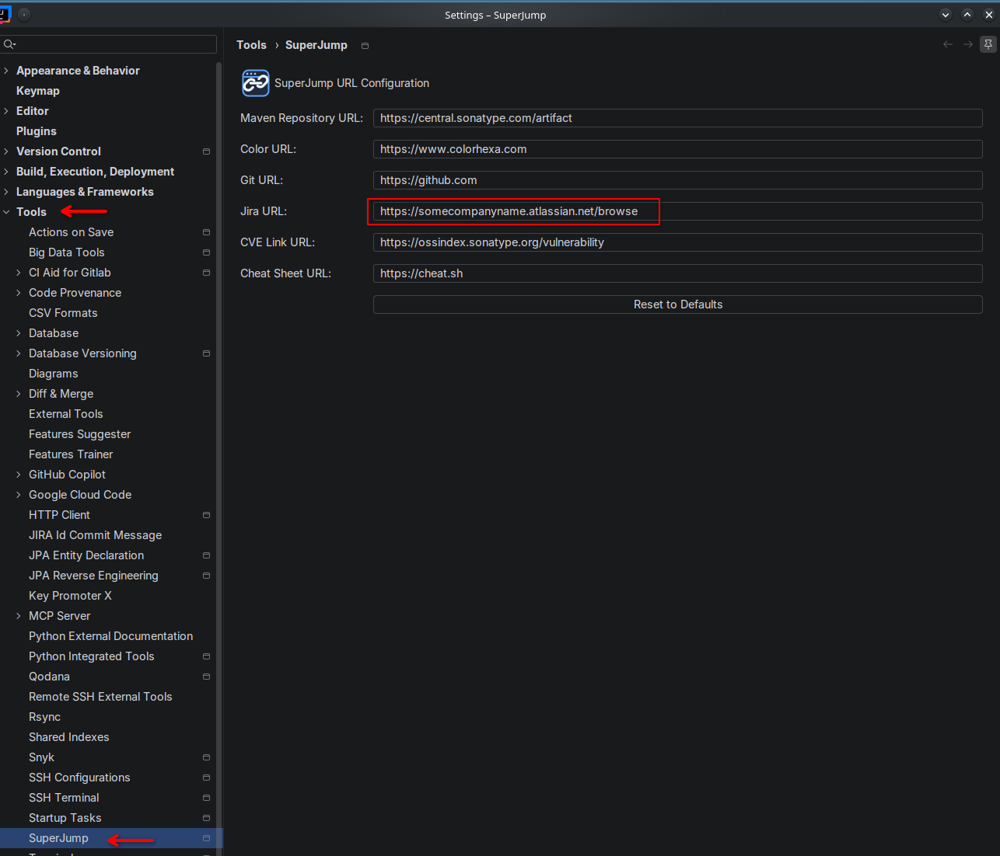

# **SuperJump**


[](https://plugins.jetbrains.com/plugin/34717)
[](https://plugins.jetbrains.com/plugin/34717)

## Description

<!-- Plugin description -->

> [!warning]
> This plugin is in beta, so please report any issues you find. I will try to fix them as soon as possible.

**SuperJump** is free and open-source IntelliJ Platform plugin that allows you to quickly jump to a specific line in
your
codebase. It provides a simple and efficient way to navigate through your code, making it easier to find and edit the
lines you need.

For example, if you are working on a large codebase and need to jump to a specific line in a file, you can use
**SuperJump** to quickly navigate to that location in your git repository without having to search for it manually.
This can save you a lot of time and effort, especially when working on complex projects with many files and lines of
code.

## Example of usage:

### **SuperJumpGit**

This takes the current file and line number and jumps to the same file and line number in the git repository.

For example if you are in IntelliJ and editing a file called `UrlSettingsPanel.kt` in folder `com/cornmell/superjump`
and you are currently on line 42, **SuperJumpGit** will take you

* https://github.com/jimcornmell/SuperJump/blob/main/src/main/kotlin/com/cornmell/superjump/UrlSettingsPanel.kt#L42

### **SuperJump**

**SuperJump** analyzes the text under the cursor and jumps to a specific location based on the text. The following table
shows some examples of what **SuperJump** can do:

| Text                                                           | Action                                                           | Default URL                                  | Navigate to URL                                                                  |
|----------------------------------------------------------------|------------------------------------------------------------------|----------------------------------------------|----------------------------------------------------------------------------------|
| `cve-2021-44228`                                               | Jump to the CVE-2021-44228 page on the configured website        | https://guide.sonatype.org/vulnerability     | https://guide.sonatype.com/vulnerability/CVE-2021-44228                          |
| `https://jimscosmos.com/code/`                                 | Open the website in your default browser                         | N/A                                          | https://jimscosmos.com/code/                                                     |
| `dj-1234`                                                      | Jump to the Jira ticket DJ-1234 in your configured Jira instance | https://somecompanyname.atlassian.net/browse | https://somecompanyname.atlassian.net/browse/DJ-1234                             |
| `ls`                                                           | This looks like a command so jump to documenation for it.        | https://cheat.sh                             | https://cheat.sh/ls                                                              |
| `#ff0000`                                                      | This looks like a colour so jump to some information             | https://www.colorhexa.com                    | https://www.colorhexa.com/ff0000                                                 |
| `implementation("org.eclipse.jdt:junit:3.3.0-v20070606-0010")` | Jump to the Maven dependency                                     | https://central.sonatype.com/artifact        | https://central.sonatype.com/artifact/org.eclipse.jdt/junit/3.3.0-v20070606-0010 |
| `org.eclipse.jdt:junit:3.3.0-v20070606-0010`                   | Jump to the Maven dependency                                     | https://central.sonatype.com/artifact        | https://central.sonatype.com/artifact/org.eclipse.jdt/junit/3.3.0-v20070606-0010 |
| `monaqa/dial.nvim`                                             | Jump to the GitHub repository `monaqa/dial.nvim`                 | https://github.com                           | https://github.com/monaqa/dial.nvim                                              |

> [!note]
> Any text which does not match any of the above performs a **SuperJumpGit**, i.e. it will jump to the repository
> location for the current file and line.

Please raise a pull request if you have any suggestions for new features or improvements.

Over time I'm going to make **SuperJump** smarter and smarter, so it can jump to more and more locations based on the
text under the cursor.

## Requirements

IntelliJ IDEA 2026.1 or more recent (I **try** to support releases as they come out, but I can't guarantee that it will
work on all versions). That said this project is simple and should work on any version of IntelliJ IDEA that supports
modern plugins.

* I let Toolbox automatically update my IDE, so I can test the plugin on the latest version.
* There is no special requirements for the plugin (so it **should** work with any version that the plugin installs in,
  but I make no guarantees 😃 ).

## Contributing

This is an open source project open to anyone. Contributions are extremely welcome!  Just raise a pull request or open
an issue if you have any questions or suggestions.

## Installation

- Using the IDE built-in plugin system:

  <kbd>Settings/Preferences</kbd> > <kbd>Plugins</kbd> > <kbd>Marketplace</kbd> > <kbd>Search for "SuperJump"</kbd> >
  <kbd>Install</kbd>

- Using JetBrains Marketplace:

  Go to [JetBrains Marketplace](https://plugins.jetbrains.com/plugin/34717) and install it by clicking the <kbd>Install
  to ...</kbd> button in case your IDE is running.

  You can also download the [latest release](https://plugins.jetbrains.com/plugin/34717/versions) from JetBrains
  Marketplace and install it manually using
  <kbd>Settings/Preferences</kbd> > <kbd>Plugins</kbd> > <kbd>⚙️</kbd> > <kbd>Install Plugin from Disk</kbd>

- Manually:

  Download the [latest release](https://github.com/jimcornmell/SuperJump/releases/latest) and install it manually using
  <kbd>Settings/Preferences</kbd> > <kbd>Plugins</kbd> > <kbd>⚙️</kbd> > <kbd>Install Plugin from Disk</kbd>

## Configuration

**SuperJump** can be configured by going to:

<kbd>Settings/Preferences</kbd> > <kbd>Tools</kbd> > <kbd>SuperJump</kbd>



The defaults should work for most users, but you can configure the plugin to your liking.

There is one exception, if you want to jump to a jira ticket you need to configure the url for your jira instance.
Then you can set the url for your jira instance in the <kbd>Jira URL</kbd> field. Highlighted in the image above.

### Urls

You can use your own urls in the settings. Just replace the defaults with your own urls.

### Keyboard shortcuts:

#### IntelliJ IDEA

Default keyboard shortcuts for **SuperJump** and **SuperJumpGit** are:

* **SuperJump**: <kbd>Ctrl</kbd> + <kbd>Alt</kbd> + <kbd>Shift</kbd> + <kbd>U</kbd>
* **SuperJumpGit**: <kbd>Ctrl</kbd> + <kbd>Alt</kbd> + <kbd>Shift</kbd> + <kbd>W</kbd>

You can overwrite the default keyboard shortcuts in IntelliJ IDEA by going to:

<kbd>Settings/Preferences</kbd> > <kbd>Keymap</kbd> and searching for "SuperJump" or "SuperJumpGit".

#### VIM

You can map the **SuperJump** and **SuperJumpGit** actions to your preferred key combinations in your `.ideavimrc` file.
For example, you can use the following mappings:

```vim
nmap gs <Action>(SuperJump)
nmap gw <Action>(SuperJumpGit)
```

## Building

It's a standard Gradle IntelliJ plugin project, so follow the instructions in
the [Gradle IntelliJ Plugin](https://plugins.jetbrains.com/docs/intellij/gradle-prerequisites.html) documentation to
build it.

## Feedback

File a bug in [GitHub Issues](https://github.com/jimcornmell/superjump/issues).

## License

GNU GENERAL PUBLIC LICENSE - Version 3, 29 June 2007 - See [LICENSE](LICENSE.txt) file.


